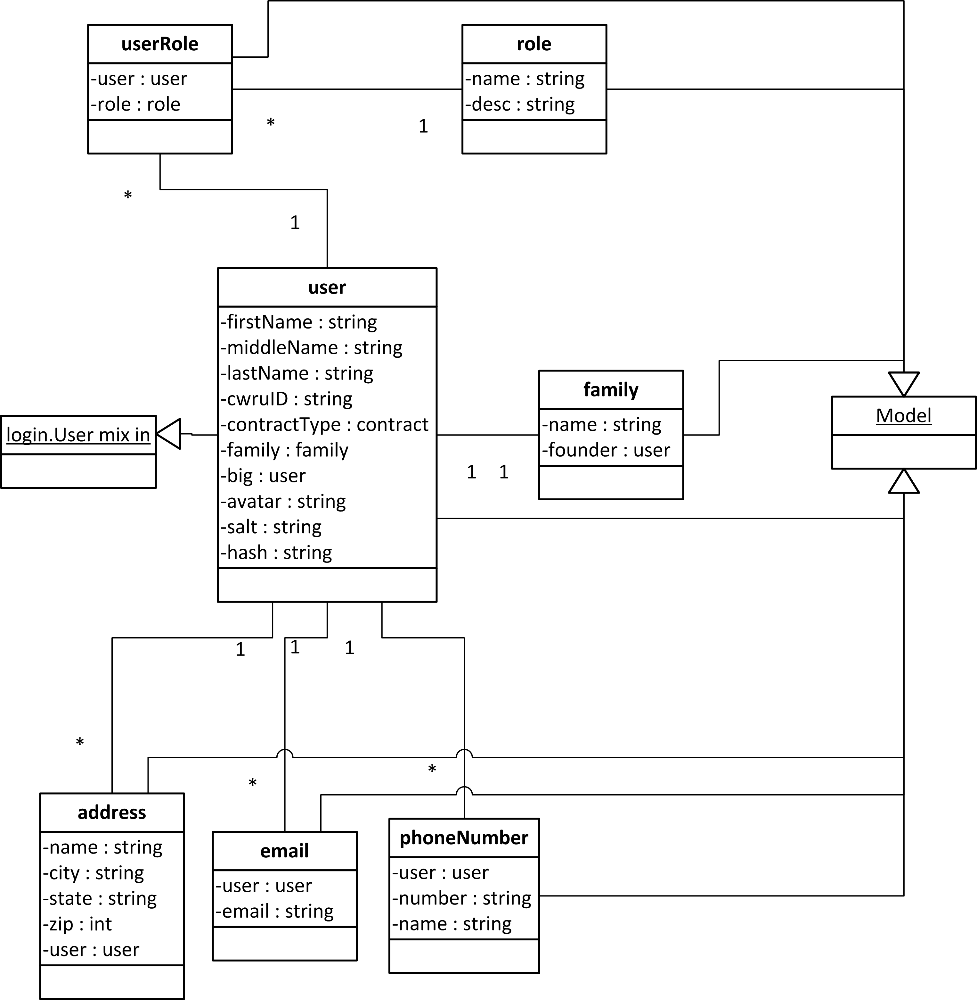

:mod:`accounts` -- User Account Package
===================================================

In order to support the features described in the other sections of
this document it is necessary to have user accounts. The accounts
package contains all of the helper methods needed to support user
accounts. It also includes a number of views, templates and forms that
are used by the main application to render the user interface for
account related tasks.

:mod:`accounts.accounts` -- User Account Module
-----------------------------------------------------------

This module contains all of the helper functions and classes used in
account related activities. These include tasks such as account
creation, account retrieval, account login and account deletion.

Security Considerations
***********************

While this application will not be storing highly sensitive
information it is still important to have strong security. For one
thing many users use the same password across multiple sites. The
security of the account module is designed so that if an attacker were
to compromise the database they would have a difficult time recovering
the actual user accounts. The login methods also must be hardened
against brute force attacks.

For these security reasons the :mod:`accounts.accounts` module uses
the Factory design pattern. Other packages and modules access user
accounts by using either the :func:`accounts.accounts.createUser` and
:func:`accounts.accounts.findUsers` function. These functions return 
User class instances which can be used to retrieve information about a user,
delete a user or modify a user's information.

In order to make the site secure logins will only be allowed over an
HTTPS connection using the valid SSL certificate that is provided to
every GAE domain. Each User will have a unique string of salt that is
generated using a cryptographic psuedo random number generator. This
salt will be added to the users password and hashed. The hashing
algorithm used will be :term:`Password Based Key Derivation Function 2` :term:`PBKDF2`.
Only the salted
and hashed password will allowed to be stored anywhere in the
datastore. 

The SSL certificate provides session authentication and encryption
preventing man in the middle attacks. The hash ensures that if an
attacker did compromise the datastore the attacker would not be able
to recover the user's password. The PBKDF2 hashing algorithm will also
include an intentional delay so that brute force attacks are
prevented.

Imports
*******

The accounts module imports the following packages

* :ref:`Crypto <Crypto>` -- Used for the hashing and cryptographic number generators

Classes
*******

.. module:: accounts.accounts

.. class:: __User(login.UserMixin)

   This class is the main class used for accounts. It contains
   the information about a specific user that is in the datastore.
   This class is a wrapper around the base User model.

   This class cannot be instantiated by anything other than the
   :func:`accounts.accounts.createUser` method and the
   :func:`accounts.accounts.findUsers` method. This is to prevent
   security issues when dealing with passwords. It is also to enforce
   uniqueness among users, so that multiple users with the same id
   cannot be created.

   .. attribute:: __UserModel
   
     This is an instance of the :class:`accounts.models.__UserModel`
     class.

     This instance is associated with the instance at creation by the
     factory methods in :ref:`accounts.accounts <accounts.accounts factory methods>`

   .. method:: __init__(self):
   
      This method can only be called from the factory methods included
      in :ref:`accounts.accounts <accounts.accounts factory methods>`

   .. method:: save()

      Takes the attributes currently attached to the class instance
      and copies their values to the internal __UserModel datastore
      object. It then calls the `put` method on the __UserModel
      instance for this class.

      If the user that this instance represents is no longer in the
      datastore then this method will attempt to create it.

      :rtype: bool - Returns True if successful, false otherwise
  
   .. method:: delete()

      Removes the user in the datastore this instance represents. 

      :rtype: bool - True if successful, False otherwise

      .. note:: This instance can recreate the user via the save method

   .. method:: __getattribute__(self, name)

      Override of built in __getattribute__ method. This method will
      allow access to internal database model's parameters by the
      normal "Object.attr" syntax.

      if this instance has an attribute matching the name then it will
      return that attribute. Otherwise it will return the value of the matching
      attribute in the internal __UserModel instance.

      This means if a change to the user is pending it will show the
      pending change, otherwise it will show the value saved in the
      datastore.

      If an attribute does not exist it raises the exception type `AttributeError`
      
   .. method:: __setattr__(self, name, value)

      This method overides the built in __setattr__ method. This
      method allows setting of the internal database model's
      parameters by the normal "Object.attr = value" syntax.

      This method disallows adding any field that is not in the
      UserModel class. It also disallows setting the UserModel
      attributes hash and salt manually. All values will be saved as
      an attribute on this instance.

      If an attribute is required in the datastore instance it is
      required here. Meaning it cannot be set to None or blank.

      A validator is code that checks for certain properties of an attribute.

      It contains special validators for the following fields

      cwruID - This attribute must be unique across all users

      If an attribute does not exist or a validator is violated then
      this method raises the exception type `AttributeError` 

      :param name: the name of the attribute -- e.g. "firstName"
      :type name: unicode

      :param value: The value to store in the attribute with "name"
      :type value: Type of attribute with "name" 

      :rtype: Type of the attribute with "name"

      .. note:: Setting the attribute does not update it in the
      datastore, it only sets that attribute on that class. Calling
      the `save()` method will actually save the attributes. This is
      done to allow a view to rollback pending changes to the User.

   .. method:: set_new_password(password)

      This method updates the User's password. It does so by first
      generating new salt for the user then hashing the password with
      the new salt. Both the new salt and hash are saved to the
      internal __UserModel

      :param password: A unicode string containing the new password
      :type password: unicode

      :rtype: None

   .. method:: check_password(password)

      This method takes in a password and hashes it with the salt for
      this user. If the password matches it returns `True` otherwise it
      returns `False`

      :param password: A unicode string containing the password to be verified
      :type password: unicode

      :rytpe: True or False

   .. method:: rollback([name=None])

      This method will copy the values of the internal datastore instance object,
      `__UserModel`, attributes into this instance's attributes
      overwriting any pending changes.

      If a name is specified then it will only rollback the change to
      the attribute with that name.

      :param name: Name of attribute to rollback
      :type name: unicode

   .. method:: key()
   
      This method provides access to the internal __UserModel
      instance's key() function. This method returns the key of the
      datastore entity this class instance represents.

      :rtype: int

   .. method:: get_id(self):
   
      This is an override of the :class:`login.UserMixin` base class's
      `get_id` method. It returns the instance's cwruID attribute
      value.

      This is used by the :ref:`Flask-Login` module to set the user cookie.

      :rtype: unicode

Module Functions
****************

.. _accounts.accounts factory methods:

.. function:: accounts.accounts.createUser(firstName, lastName, cwruID, password[, **kwargs])

   This method is a factory method for User accounts. It takes in the
   required fields of firstName, lastName and cwruID. It queries the
   database to make sure that cwruID is unique. If it is not an
   `AttributeError` exception is raised with the message stating that the cwruID
   is not unique. It then
   generates a string of salt using the secure random number generator
   in the :mod:`Crypto <Crypto>` module. The provided password is then
   hashed with the salt.  All of this information is added to an
   instance of a UserModel class from the :ref:`accounts.models <accounts.models>` module.

   If any optional arguments are supplied through the kwargs
   dictionary they are checked against the attributes of the UserModel
   class. If the argument matches an attribute in the UserModel and 
   the attribute is modifiable outside of the accounts module and
   the value is a valid value for that attribute it is added to the
   UserModel instance created during the initial steps. If these
   conditions are not met an `AttributeError` exception is raised with
   the message specifying the argument that caused the problem.

   Finally the entire UserModel instance is saved to the datastore via
   the UserModel's put method. This UserModel is then stored inside of
   a new instance of :class:`accounts.accounts.__User`.

   If everything was successful the User instance is returned,
   otherwise None is returned.

   :param firstName: First name of new user
   :type firstName: unicode

   :param lastName: Last name of new user
   :type lastName: unicode

   :param cwruID: CWRU ID of new user (must be unique)
   :type cwruID: unicode
   
   :param password: Desired password for new user
   :type password: unicode

   :param **kwargs: Optional attributes to be specified during user creation
   :type **kwargs: varies based on attribute specified

   :rtype: :class:`accounts.accounts.__User` or None

.. function:: accounts.accounts.findUsers([limit=None[, **kwargs]])

   This method is used to retrieve already created User entities. It
   queries the database for all users matching the attributes in
   kwargs.

   limit when None means that all matching users will be returned. If
   limit is set to a number then all users matching the query will be
   returned up to the amount specified by limit.

   For each user found an instance of
   :class:`accounts.accounts.__User` is created and added to a
   list. This list is returned at the end.

   If no users are found the list will be empty.

   Query parameters will be specified by tuples. The first item in the
   tuple will be the search operator e.g. '=' and the second item
   will be the value of that search operator.

   So to search for a list of Users with a lastName of 'Smith' and a
   firstName of 'John' the function call would be

   `findUsers(lastName=('=','Smith'), firstName=('=','John'))`

   :param limit: Maximum number of users to return
   :type limit: int or None

   :param **kwargs: attribute keys and associated query tuples
   
   :rtype: list of :class:`accounts.accounts.__User` instances

.. function:: require_role(view, names, redirect)

   This method is a :term:`decorator` function. This function takes in
   a view function and a list of names. If the current user has one of
   the roles associated with it then it will allow the user
   in. Otherwise it will redirect to the page specified by
   redirect.

   :param view: view function (This will be automatically filled in when used as a decorator)

   :param names: A list of roles that can access this page
   :type names: A list of unicode strings

   :param redirect: The url to redirect to
   :type redirect: unicode

:mod:`accounts.models` -- Account Related Models
-----------------------------------------------------------

.. _accounts.models:

   .. class:: accounts.models.__UserModel(db.Model)

      Creates an instance of a User in the datastore

      .. attribute:: firstName 
         
	 * unicode 
	 * required

      .. attribute:: lastName
         
	 * unicode 
	 * required

      .. attribute:: cwruID
         
	 * unicode 
	 * required

      .. attribute:: salt
         
	 * unicode 
	 * required

      .. attribute:: hash 
         
	 * unicode 
	 * required

      .. attribute:: middleName
      
         * unicode 
	 * optional

      .. attribute:: contractType 

         * Reference to ContractModel
	 * optional

      .. attribute:: family 
      
         * Reference to FamilyModel
	 * optional

      .. attribute:: big 
         
	 * SelfReference
	 * optional

      .. attribute:: avatar 
         
	 * unicode
	 * optional
      

      .. method:: __init__(firstName, lastName, cwruID, salt, hash[, middleName, contractType, family, big, avatar])

         Creates a new User Model instance to access the datastore.
      
         :param firstName: User's first name
         :type firstName: unicode

         :param lastName: User's last name
         :type lastName: unicode

         :param cwruID: User's Case network ID.
         :type cwruID: unicode

         :param salt: A unique string (per user) used in password hashing
         :type salt: unicode

         :param hash: A hash of the user's password with the user's salt
         :type hash: unicode

         :param middleName: User's middle name
         :type middleName: unicode

         :param contractType: User's Contract type
         :type contractType: application.models.Contract

         :param family: User's family
         :type family: application.models.Family

         :param big: User's big
         :type big: application.models.User

         :param avatar: User's gravatar user name
         :type avatar: unicode

   .. class:: accounts.models.RoleModel(db.Model)

      This class is used to store the various roles in the
      chapter. Roles are associated with a UserModel via an entry of a :class:`accounts.models.UserRoleModel`
      
      An example role is one with `name` of 'Administrator' and `desc`
      of 'Users with this role have access to all pages on the
      website'

      .. attribute:: name
         
	 * unicode
	 * required
      
      .. attribute:: desc - unicode, optional

      .. method:: __init__(name[, desc])

         Creates a new Role Model in the datastore
	 
	:param name: Name of the Role - e.g. admin
        :type name: unicode

        :param desc: Description of the Role
        :type desc: unicode

   .. class:: accounts.models.UserRoleModel(db.Model)

      This class maps Roles to Users thus resolving the many to many
      relationship between Users and Roles.

      .. attribute:: user
      
         * Reference to __UserModel
	 * required

      .. attribute:: role - Reference to Role, required

      .. method:: __init__(user, role)

         Creates a new UserRoleModel instance

	 :param user: Reference to a User
	 :type user: Reference
	 
	 :param role: Reference to a Role
	 :type role: Reference
      
Account Model Diagrams
**********************

:mod:`accounts.views` -- Account Related Views
---------------------------------------------------------

.. module:: accounts.views

.. function:: login

   Accepts GET and POST requests.

   If a POST request expects the information from :class:`accounts.forms.LogInForm`
   to be present.

   If a GET request allows for an optional parameter of `next` which
   is a url encoded reference to the page the user should be forwarded
   to upon the next request.

   If a GET request the :ref:`LogIn Template` will be rendered.

   If a POST request the form data will be validated and then the user
   password and cwruID combination will be checked. If successful the
   user will be forward to the page specified by the `next`
   GET parameter. If no `next` parameter is specified the user will be
   forwarded to the homepage. If the login is unsuccessful then the
   user will be returned to the login page, however, this time it will
   be through a GET request.

   .. note:: This view is specified as the login_manager.login_view in the main application configuration.

.. function:: changePassword

   Accepts GET and POST requests.

   If a POST request expects the information from
   :class:`accounts.forms.UpdatePasswordForm` to be present.

   If a GET request then the :ref:`Update Password Template` is
   rendered.

:mod:`accounts.forms` -- Account Related Forms
---------------------------------------------------------

.. module:: accounts.forms

.. class:: LogInForm(wtf.Form)

   This class is used for validating user input during a login.

   .. attribute:: username
   
      * TextField
      * Required

   .. attribute:: password

      * PasswordField
      * Required
      * Must be greater than 6 characters and contain at least one number and one uppercase letter

.. class:: UpdatePasswordForm(wtf.Form)

   This class is used for validating user input during a password
   change.

   .. attribute:: oldpassword

      * PasswordField
      * Required

   .. attribute:: newpassword1
   
      * PasswordField
      * Required
      * Must match newpassword2 attribute

   .. attribute:: newpassword2
   
      * PasswordField
      * Required
      * Must match newpassword1 attribute

Account Templates
-----------------

.. module:: accounts.templates

Login Template
**************

This template renders the login form.

It requires an instance of :class:`accounts.forms.LogInForm`

Update Password Template
************************

This template renders the update password form.

It requires an instance of :class:`accounts.forms.UpdatePasswordForm`
   
