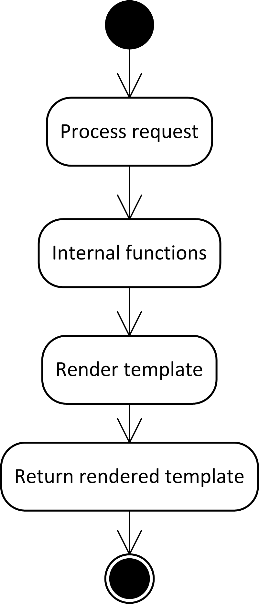
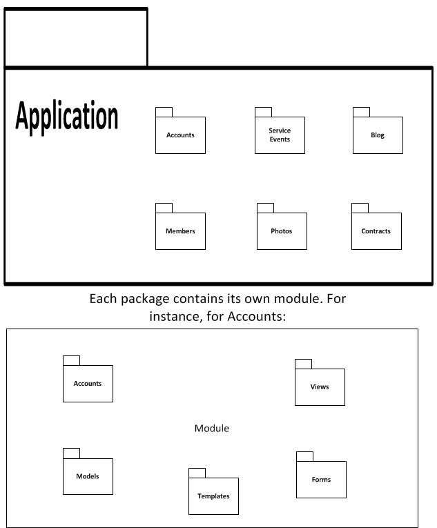

Application Architecture
========================

Main Components
---------------

There are four main types of components that the application is made
from

#. Views

#. Templates

#. Forms

#. Models

Each of these components is described in section Views through
section Models.

Views
~~~~~

A view in Flask is a function or class that handles a web request. The
view has one or more URL's routed to it through Flask's URL system. The
general program flow for a View is shown in figure
View Procedure Diagram.

   
The View starts off by taking in the user request object provided by
Flask. The request object contains all of the information about the web
request including the type (e.g. POST or GET). The View takes the
information in the request and runs any internal procedures needed to
process the data. These internal procedures may include things like
querying the datastore. Finally the View renders the associated
template. While rendering the template the View will pass in any
parameters that change from render to render. Finally the View returns
the rendered template to Flask which passes it back as an
HTML/javascript page to the user who initiated the request.

Templates
~~~~~~~~~

There are many HTML templating languages for Python. Flask defaults to
using Jinja2. Jinja2 allows basic logic in the templates and can accept
Python objects to be displayed in the rendered page.

Jinja2 also supports inheritance. A template can contain what are known
as "blocks". Blocks can be overridden by templates that inherit from the
main template where the block was defined. This allows a site to have a
hierarchical template definition. For instance a website can have a main
template which includes the static parts of a page that never change and
each individual page can extend the page and add their own content.

Forms
~~~~~

To support server side form validation the WTForms package is being used
with the Flask-WTF extension. Forms are defined via subclasses of the
main form class. The subclassed forms specify the specific fields as
well as their validation criteria. A View can use an instance of the
form to render the HTML form elements on a page and to validate that the
received form data meets the criteria specified in the class.

Models
~~~~~~

Google's Bigtable requires the definition of Models instead of a
traditional schema. Models are inheritable. The website models are
subclasses either PolyModel or Model. PolyModel derived classes support inheritance. Model derived
classes are the standard model type. Expando derived classes support
having additional fields stored with an entity of the model even when
that additional data was not specified in the original model.

In this document's diagrams, Models are shown as classes (because they
are implemented as classes). References are shown by denoting a member
variable's type as the type of a model defined in this document.

Google App Engine's SDK provides a number of basic modules that are used within our source code. The following section describes the important aspects of these modules.

:mod:`db` -- Datastore Classes
******************************

.. _gaedb:

.. class:: db.Model

    Basic Model instance that provides the following methods.

    .. method:: put()

       Updates the information in the datastore with the information in the Model instance's attributes

       Will create a new entry in the datastore if it doesn't exist

    .. method:: delete()

       Removes the entity from the datastore that this Model instance is associated with

    .. method:: key()

       Returns the key that this Model instance is associated with. The key is used when making references in the datastore

       .. warning:: If the instance has not yet been saved via the `put` method the key method will raise an exception

.. class:: db.PolyModel

   Same as :class:`db.Model`, however, this model allows for
   inheritance. This is useful because a base model can be specified
   that contains attributes that both classes require. The subclasses
   can then add their own attributes. But most importantly it allows
   for polymorphic references. That is another model can specify a
   reference to the Base class and accept a reference to any subclass.

Flask-Login
-----------

Flask provides a number of extensions on their website written by
various developers. This project uses an extension known as
Flask-Login. Flask-Login provides a number of helper methods and
classes for doing user logins.

Full documentation can be found at 
`http://packages.python.org/Flask-Login/ <http://packages.python.org/Flask-Login/>`_

Functions and Classes Utilized
~~~~~~~~~~~~~~~~~~~~~~~~~

.. function:: login_required(fn)

    This is a :term:`decorator` function. If a view function is decorated with this then the user attempting to access this view will need to be authenticated.

.. class:: current_user()

   This class represents the currently logged in user. It provides methods to check if the user is logged in and if the user has reauthenticated within a certain period.

Packages
--------

There are four main packages. Each package contains the definitions of
one of the component types specified in section Views through
section Models. So for instance the template package contains all
of the templates used in the system. The package structure is shown in
figure PackageStructure.

