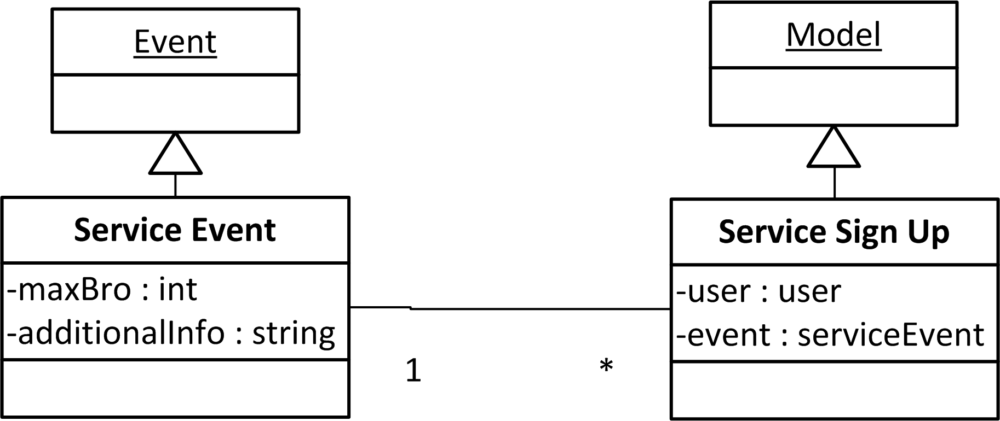

:mod:`serviceEvent` -- Service Event Tracking Package
=================================================================

:mod:`serviceEvent.serviceEvent` -- Service Event class
-------------------------------------------------------

Classes
*******

.. module:: serviceEvent.serviceEvent

.. class:: serviceEvent(object)
    
   The ServiceEvent class will allow :term:`brother`s to create and sign up for :term:`service event`s.
   It contains the information about specific service events in the datastore.
   
   .. method:: save()
   Saves the attributes attached to the class instance to the ServiceEvent datastore object
  
   .. method:: delete()
   Removes the current class instance ServiceEvent object from the datastore
   
   .. method:: __setattr__(self, name, value)

   This method overides the built in __setattr__ method. This
   method allows setting of the internal database model's
   parameters by the normal "Object.attr = value" syntax.
   
   This method disallows adding any field that is not in the
   ServiceEvent class. All values will be saved as
   an attribute on this instance.

   If an attribute is required in the datastore instance it is
   required here. Meaning it cannot be set to None or blank.

   A validator is code that checks for certain properties of an attribute.

   It contains special validators for the following fields
   
   maxBrothers - must be None or blank or greater than 0
   
   signedUp - must be less than or equal to maxBrothers if maxBrothers is not None or blank

:mod:`serviceEvent.serviceReport` -- Service Report class
---------------------------------------------------------

.. module:: serviceEvent.serviceReport
   
.. class:: serviceReport(object)

   The ServiceReport() class allows the submission of :term:`service report`s and :term:`service hour`s
   It contains the information about specific service report types in the datastore.
   
   .. method:: save()
   Saves the attributes attached to the class instance to the ServiceReport datastore object
  
   .. method:: delete()
   Removes the current class instance ServiceReport object from the datastore
   
   .. method:: __setattr__(self, name, value)

   This method overides the built in __setattr__ method. This
   method allows setting of the internal database model's
   parameters by the normal "Object.attr = value" syntax.
   
   This method disallows adding any field that is not in the
   ServiceReport class. All values will be saved as
   an attribute on this instance.

   If an attribute is required in the datastore instance it is
   required here. Meaning it cannot be set to None or blank.

   A validator is code that checks for certain properties of an attribute.

   It contains special validators for the following fields
   
   hours - must be greater than 0
   
   ServiceEvent - must be an existing ServiceEvent in the datastore
   
Module Functions
****************  
.. function:: serviceEvent.serviceEvent.createEvent

   This method is a factory method for service events. 

.. function:: serviceEvent.serviceEvent.eventList

   This method returns a list of current service events from the datastore

.. function:: serviceEvent.serviceEvent.signUp(name)

   This method adds a name to the service event sign up list
   
   :param name: Name of user
   :type name: unicode
   
   :rtype: bool
   
.. function:: serviceEvent.serviceEvent.unsignUp(name)

   This method removes a name from the service event sign up list
   
   :param name: Name of user
   :type name: unicode
   
   :rtype: bool

.. function:: serviceEvent.serviceReport.createReport

   This method is a factory method for service reports.
   
.. function:: serviceEvent.serviceReport.verifyReport

   This method allows :term:`exec` to reject a service report
   Service reports that are rejected are removed from the datastore

.. function:: serviceEvent.serviceReport.addHours(hours)

   This method adds hours submitted to a :term:`brother`'s current :term:`contract`.
   
   :param hours: Number of hours to add
   :type hours: int
   
:mod:`serviceEvent.models` -- Service Event related Models
-----------------------------------------------------------

.. module:: serviceEvents.models

.. class:: ServiceEvent(application.Event)

   .. method:: __init__([maxBro[,addInfo]])

      Creates a new ServiceEvent entity

      :param maxBro: Maximum number of brothers allowed at service Event
      :type maxBro: int
    
      :param addInfo: Additional information about service event

      :type addInfo: unicode
    
      :rtype: ServiceEvent

.. class:: ServiceSignUp(db.Model)

   .. method:: __init__(user, event)

      Creates a new ServiceSignUp entity

      :param user: User for service event sign up
      :type user: application.models.User
    
      :param event: Event that user is signing up for
      :type event: application.models.Event
 
.. class:: ServiceReport(db.PolyModel)

   Creates a new ServiceReport entity

   .. warning::
      This class is an abstract base class. Do not instantiate an instance of this class
      
.. class:: InsideServiceReport(ServiceReport)

   .. method:: __init__(event)

      Creates a new InsideServiceReport entity

      :param event: Service Event that this report is for
      :type event: application.models.ServiceEvent

.. class:: OutsideServiceReport(ServiceReport)

   .. method:: __init__(name, desc, loc, date)

      Creates a new OutsideServiceReport entity

      :param name: Name of event this report is for
      :type name: unicode

      :param desc: Description of event this report is for
      :type desc: unicode

      :param loc: Description of location of event this report is for
      :type loc: unicode
 
      :param date: Date of event this report is for
      :type date: datetime.date

.. class:: ServiceHour(db.Model)

   .. method:: __init__(user, report, minutes[, dMinutes])

      Creates a new ServiceHour entity

      :param user: User this service hour is for
      :type user: application.models.User

      :param report: Service report this hour entry is for
      :type report: application.models.ServiceReport

      :param minutes: Number of minutes of service provided
      :type minutes: int

      :param dMinutes: Number of minutes spent driving
      :type dMinutes: int

Service Model Diagrams
***************************
   

Service Hour Model diagram

Service Report Model diagram

:mod:`serviceEvent.views` -- serviceEvent related views
--------------------------------------------------------

.. module:: serviceEvents.views

.. class:: serviceEventView()

The serviceEventView is used to provide the view for service events.
   This view requires a current User instance
   This view responds to get and post requests
  :post: causes the view to store the submitted create service event or service event sign up to the datastore
  :get: displays the list of existing service events or members signed up for the event.
This view uses a template
  :Template: application.serviceEvent.serviceEventTemplate()
  
.. class:: reportHoursView()

The reportHoursView is used to report service events and hours
    This view requires a current User instance
    This view responds to get and post requests
   :post: causes the view to store the submitted service report and hours information to the datastore
   :get: displays the corresponding report hours form dependent on service report type
This view uses a template
   :Template: application.serviceEvent.reportHoursTemplate() 

:mod:`serviceEvent.forms` -- serviceEvent related forms
--------------------------------------------------------

.. module:: serviceEvents.forms

.. class:: CreateServiceEventForm(Form)

This form contains the fields for filling out the parameters of a service event in conjunction with
serviceEvent.serviceEvent.createEvent

   .. method:: CreateServiceEventForm(name, date, startTime, endTime, location[, summary, maxBrothers])
   This is the Create a Service Event Form
    
   :param name: Name of event
   :type name: unicode
   :param date: Date of the event 
   :type date: datetime.date
   :param startTime: Time event starts at
   :type startTime: datetime.time
   :param endTime: Time event ends at        
   :type endTime: datetime.time
   :param location: Location of the event
   :type location: application.models.Location
   :param summary: Description of the event
   :type summary: unicode
   :param maxBrothers: Maximum Number of Brothers
   :type maxBrothers: int
        
   :rtype: Form instance

.. class:: EventSignUpForm(Form)

This form contains the field necessary for signing up for a service event.
   
   .. method:: EventSignUpForm(name)
   Event Sign up form     
   
   :param name: Name of brother
   :type name: unicode
           
   :rtype: Form instance
   
.. class:: ReportHoursForm(Form)

This form contains the fields necessary for reporting service hours. Depending on the type of service,
the user will have to fill out the ReportInsideHoursForm or ReportOutsideHoursForm.

   .. method:: ReportHoursForm(hours, type)
   Form for reporting service hours
   
   :param hours: Number of hours
   :type hours: int
   :param type: Type of service
   :type type: unicode
   
   :rtype: Form instance

.. class:: ReportInsideHoursForm(Form)

This form contains a field for a user to input what preexisting event their hours were for. 

   .. method:: ReportInsideHoursForm(event)
   Form for reporting inside service hours
   
   :param event: Service event hours
   :type event: ServiceEvent
   
   :rtype: Form instance

.. class:: ReportOutsideHoursForm(Form)

This form containst the fields required for a user to input their outside event's information.
   
   .. method:: ReportOutsideHoursForm(name, desc, loc, date)
   Form for reporting outside service hours
   
   :param name: Service event name
   :type name: unicode
   :param desc: Service event description
   :type desc: unicode
   :param loc: Service event location
   :type loc: Location
   :param date: Service event date
   :type date: datetime.date
   
   :rtype: Form instance
   
:mod:`serviceEvent.templates` -- serviceEvent related templates
----------------------------------------------------------------

.. module:: serviceEvent.templates

.. class:: serviceEventTemplate()

Used to display service events, service event creation form, and event sign up form. 

   :Requires: application.serviceEvent.CreateServiceEventForm()
   :Requires: application.serviceEvent.EventSignUpForm()
Extends  
   :extends: MainTemplate
   :extends: serviceEventView()
   
.. class:: reportHoursTemplate()

Used to report service hours and record service events. 

   :Requires: application.serviceEvent.ReportHoursForm()
   :Requires: application.serviceEvent.ReportInsideHoursForm()
   :Requires: application.serviceEvent.ReportOutsideHoursForm()
Extends  
   :extends: MainTemplate
   :extends: reportHoursView()
